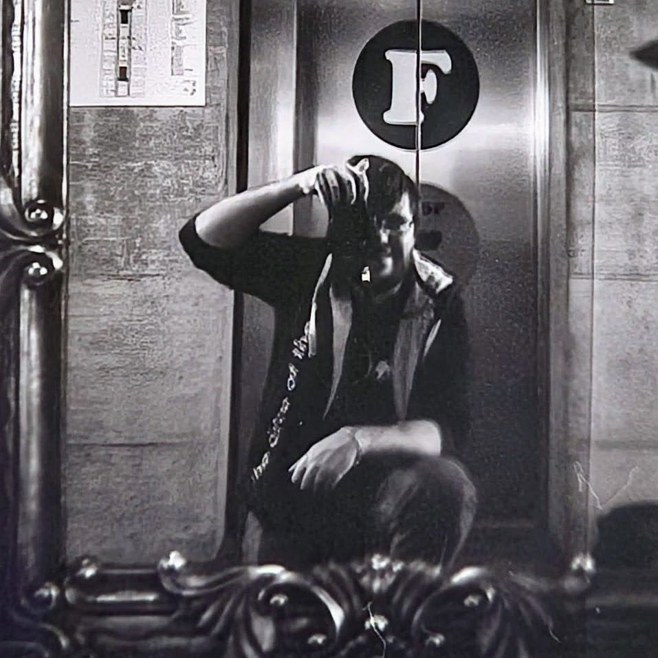
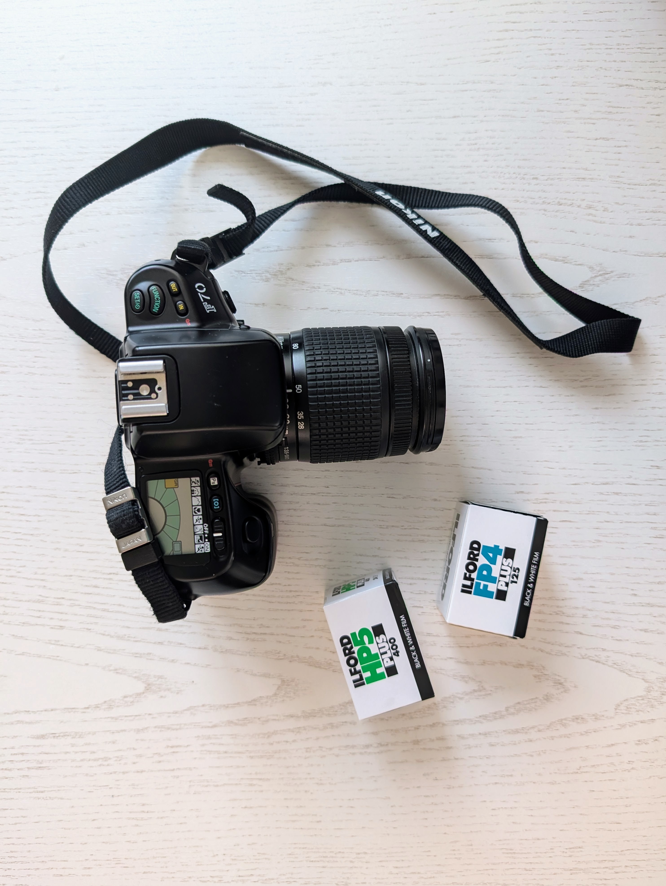

### Analog photography

Hi there, nice to see you check out my website!

I'm Martin Splitt and I'm _completely new_ to analog photography. I made this website to share not only some of my photos, but also my journey into this amazing world of capturing moments on film. Not only do I take photos on film, I also develop the film myself, because _why not_?

   

If you're wondering: "Why on earth would someone do analog photography in this day and age? There's digital photography available! Just use your smartphone!" - I hear you. But I have a few reasons, why I've embarked on this journey _and love every moment of it_!

1. It's **magical**.
   
   It is an exciting moment to pull the reel from the development tank and see the negatives that appeared on the film.
2. It changed the way I photograph _and_ the way I see the world.
   
   Sounds pathetic, maybe, but it's true. Knowing I have 24 or 36 shots and the way different films behave make me think about each photo more. I can't just shoot and check, shoot again. It also made me take the famous quote "Photography is the art of observation" much more seriously. I sometimes walk around somewhere I've walked around many times before and _still_ see something that I've never really noticed before - because now I wonder if it's worth capturing. There are subjects everywhere.
3. It is **meditative**. 
   
   Especially because I can't check the results immediately, I worry less about the perfect snapshot. I press the shutter button and move on. I know, I can still screw up in development or handling the film later. It's okay. _I learned to let go_ and enjoy the moment.
4. It's _physical_.
   
   Film is physical. You take it out of the little can, you place it in the camera, roll it into the transport, you hear it move after every photo, you take it out, you put it onto the reel, into the tank, pull it out, hang it to dry. Sounds tedious? Maybe, but it's also satisfying to handle something material.

### Black and White

To get my journey started, I decided to use black and white film. For now, I'm _too scared_ to try colour film, but eventually I'll probably get to C-41.
Using monochromatic film has an interesting side effect, I didn't think about at the beginning: _It helps me focus_ on the basics.

Subject. Composition. Light.

It forces me to think about contrast, about composition. You want to tell a story? You gotta focus on the basics.
Imagine trying to tell a story but you have very limited vocabulary to do so. Sounds tricky, but these _constraints will inspire you_.

### Gear

Right now, I primarily use my Nikon F70 with a 28-80mm f/3.5 - 5.6 zoom lens and am very happy with the results.
My favourite film stock are Illford FP4plus and HP5plus, but I've not tried many different stocks so far.

   

I got a Rollei 35 LED as well but I didn't get around shooting it much so far.

### Other works

I also do photography with more modern tools - like drones and modern Sony cameras. 

You can see more of that on [my photography website](https://martinsplitt.photo) for these kinds of work.
If you're interested in [my underwater photography](https://unterwasser.photo), they are on a separate website, too.